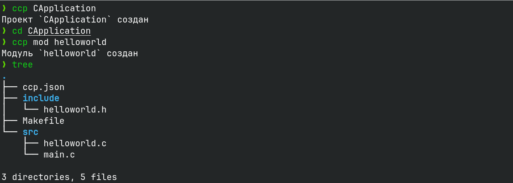

# CreateCProject
### Менеджер по созданию С и С++ приложения

CreateCProject - это инструмент для создания С и С++ приложений.

## Лицензия

CreateCProject распространяется под лицензией Apache License 2.0. См. [LICENSE](LICENSE) для подробной информации.


## Установка
### С помощью Git
```bash
git clone https://github.com/yuriyProgg/CreateCProject
cd CreateCProject
make
```

### С загрузкой
Скачайте файл [по ссылке](https://github.com/yuriyProgg/CreateCProject/releases)
- Для Windows: ccp_windows.exe
- Для Linux: ccp_linux

Рекомендация:
- Переменуйте файл в ccp

### **Добавте папку с приложением в PATH**

## Использование


### Для Windows
```cmd
ccp.exe <Имя проекта или Команда> [Флаги]
```
### Для Linux\MacOS
```bash
ccp <Имя проекта или Команда> [Флаги]
```


#### Доступные команды:  
- **`mod <Имя модуля>`**  
  Создать новый модуль в директории, указанной в `ccp.json`.  

#### Поддерживаемые флаги:  
- **`-cpp` / `-cc`**  
  Использовать C++ (расширения `.cpp` или `.cc`). По умолчанию — C.  
- **`-hpp`**  
  Использовать заголовочные файлы `.hpp` вместо `.h`.  
- **`-cmake`**  
  Генерировать `CMakeLists.txt` вместо `Makefile`.  
- **`-h`, `--help`**  
  Показать справку.  

## Примеры использования:  
**1.1. Создать проект на C++ с CMake**:  
```bash
ccp CppApplicationWithCMake -cmake -cpp -hpp
cd CppApplicationWithCMake
```  
1.2. Добавить модуль:  
```bash
ccp mod helloworld
```


**2.1. Создать проект на С с Makefile**:
```bash
ccp CApplication
cd CApplication
```

2.2. Добавить модуль:
```bash
ccp mod helloworld
```




Теперь создание проектов стало ещё удобнее! 🛠️

