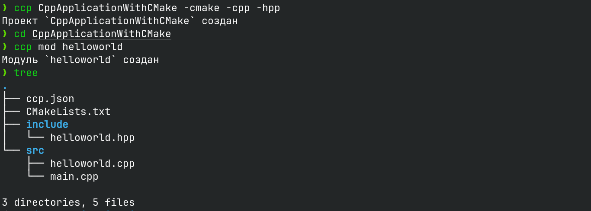

# CreateCProject
### Менеджер по созданию С\С++ приложения



CreateCProject - это инструмент для создания С/С++ приложений.

## Лицензия

CreateCProject распространяется под лицензией Apache License 2.0. См. [LICENSE](LICENSE) для подробной информации.


## Установка
### С помощью Git
```bash
git clone https://github.com/yuriyProgg/CreateCProject
cd CreateCProject
make
```

### С загрузкой
Скачайте файл [по ссылке](https://github.com/yuriyProgg/CreateCProject/releases/tag/v1.0.0)
- Для Windows: windows_ccp.exe
- Для Linux: linux_ccp

Рекомендация:
- Переменуйте файл в ccp

**Добавте папку с приложением в PATH**

## Использование
### Для Windows
```cmd
.\ccp.exe <Имя проекта или Команда> [Флаги]
```
### Для Linux\MacOS
```bash
./ccp <Имя проекта или Команда> [Флаги]
```

### Команды
- mod <Имя модуля>: Создать новый модуль в директории указанные в ccp.json 

### Флаги
- -cpp: Использовать C++. По умолчанию используется C.
- -std=<ЗНАЧЕНИЕ>: Стандарт С\С++. По умолчанию 23.
- -cmake: Использовать CMake. По умолчанию используется Makefile.
- -h, --help: Показать этот текст.
